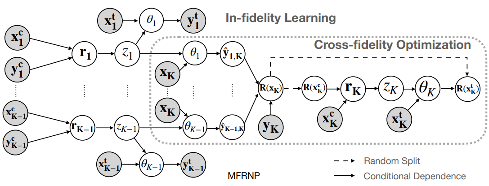

# Multi-Fidelity Residual Neural Processes for Scalable Surrogate Modeling
Code for paper "Multi-Fidelity Residual Neural Processes for Scalable Surrogate Modeling", to be presented at ICML2024.

## Abstract
Multi-fidelity surrogate modeling aims to learn an accurate surrogate at the highest fidelity level by combining data from multiple sources. Traditional methods relying on Gaussian processes can hardly scale to high-dimensional data. Deep learning approaches utilize neural network based encoders and decoders to improve scalability. These approaches share encoded representations across fidelities without including corresponding decoder parameters. This hinders inference performance, especially in out-of-distribution scenarios when the highest fidelity data has limited domain coverage. To address these limitations, we propose Multi-fidelity Residual Neural Processes (MFRNP), a novel multi-fidelity surrogate modeling framework. MFRNP explicitly models the residual between the aggregated output from lower fidelities and ground truth at the highest fidelity. The aggregation introduces decoders into the information sharing step and optimizes lower fidelity decoders to accurately capture both in-fidelity and crossfidelity information. We show that MFRNP significantly outperforms state-of-the-art in learning partial differential equations and a real-world climate modeling task.

---

<div style="text-align: center;">
  
  <p style="text-align: center;"><em>MFRNP Model Structure</em></p>
</div>


## Environment Setup
Create conda environment and install the packages:
```
conda env create -f environment.yml
```

## Download Data
[Download Data Here (data.zip)](https://drive.google.com/file/d/1HKE3tf8SUDLrK9ZnvCIKKdo4TIoRtBZY/view?usp=sharing)

Unzip the file at the root directory.
```
unzip data.zip
```

## Running Experiments
Run Full and OOD tasks (Fluid, Heat2,3,5 and Poisson2,3,5):
```
./run_task.sh
```
Run ablation study with MFRNP-H:
```
./run_task_ablation.sh
```
Results are saved at "result" directory.

## Running Single Task
```
python train.py --data_path <path_to_dataset> --save_dir <name_of_directory_to_be_saved_in_result_folder> --config <path_to_config_file> --levels <#_of_total_fidelity_levels> --device <cuda_or_cpu>
```
### Example for Running Poisson Task with 2 Fidelities on GPU
```
python train.py --data_path "data/full_dataset/poisson" --save_dir poisson --config pde_config.yaml --levels 2 --device cuda
```

## Cite Us

```
@inproceedings{niu2024multi,
  author       = {Niu, Ruijia and Wu, Dongxia and Kim, Kai and Ma, Yi-An and Watson-Parris, Duncan and Yu, Rose},
  title        = {Multi-Fidelity Residual Neural Processes for Scalable Surrogate Modeling},
  booktitle    = {International Conference on Machine Learning, {ICML} 2024},
  series       = {Proceedings of Machine Learning Research},
  year         = {2024}
}
```
